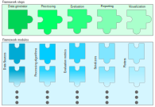

# User documentation

- [Introduction](introduction.md)
- [Prepare the environment](prepare.md)
- [Basic demonstration](Basic_demonstration.md)
- [Module descriptions](module_descriptions.md)
  - [Data generators](data_generators.md)
  - [Algorithms](algorithms.md)
  - [Metrics](metrics.md)
  - [Reporting](reporting.md)
  - [Visulaization](visualization.md) 
